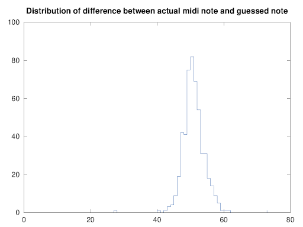
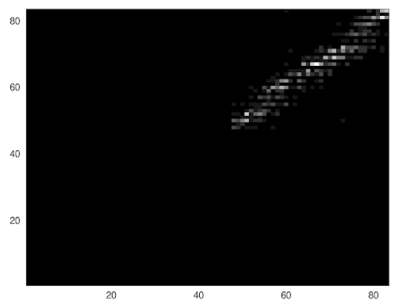

# Pitch Estimation

As I understand it, almost everyone has a built in audio spectrum analyser
hardware and, in most cases, it's broken in a very annoying way. A small
minority of people can measure absolute pitch and most (myself included)
can't. Good relative pitch perception seems fairly normal, as far as I
can tell.

Accurate measurement of audio frequency would be a useful debugging tool, 
I think :-) 

Presumably, pitch perception didn't play much of a role in evolution. My
made up scenario of one sabre toot tiger to the east and one to the west,
_I think that the one to the east is bigger because I can tell from the
growl pitch_ is a bit of a stretch ...

I'd like to understand this better, anyway, as usual all I have is Debian
Linux and BASH.

# Method

* There's a script called **r** which plays a random MIDI note. 
* Immediately after that you are prompted to guess the note as MIDI octave number followed by the note letter - for example a guess of 6c would be middle C. Use lower case for the letter, I don't even bother with sharps and flats for reasons which will become clear shortly.
* The script tells you how you did. 
* Leave long gaps, so you cannot exploit relative pitch, where the result of the first test informs the second. There are timestamps in the results as a way of determining if there is an effect here.

# Results

I took over six hundred samples spread over weeks and then looked at the distribution. 

The first graph shows the distribution of errors, centered around 50 for my convenience. The X axis is in MIDI  The X axis is in MIDI note numbers.

_So now you can see why I didn't really bother with sharps and flats ..._

I wanted to know whether higher or lower notes were more or less accurately estimated:

_No, bad right the way through!_ I think that maybe I'm slightly better
at detecting the G above Middle C but there's not much in it.

# Conclusion

Well, it turns out that my built in audio spectrum analyser is pretty
crap.

Perhaps this is automatically better for people who play musical
instruments?  I don't.

If you are within the extremely select group of people who are interested
in this and run Debian, I'd be fascinated to know what your stats
were. And it would make an interesting Citizen Science project and a
**very dull** game.

If I had the skills, I'd turn this into an app and / or a webpage. I'm
curious about absolute pitch perception and whether there are tricks to
improve it.

